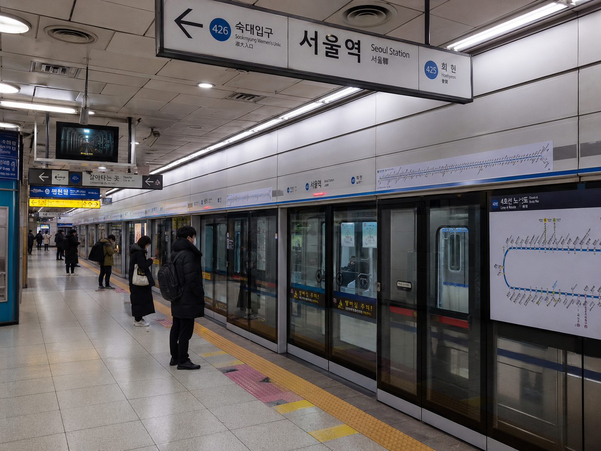

---

title: "서울 지하철 유동인구와 상권 매출 분석"
date: 2026-06-26
description: "유동인구가 많은 지하철역이 실제 매출도 높은 상권인지 분석한 데이터 분석 프로젝트"
categories: ["AI", "Data Analysis"]
tags: ["상권분석", "서울시", "지하철", "유동인구", "매출분석", "회귀분석"]
image: "Seoul_Subway_Station.png"
draft: false
------------

# 서울 지하철 유동인구와 상권 매출 분석

## 1. 프로젝트 한 줄 요약

유동인구가 많은 지하철역이 실제로 매출도 높은 상권인지 확인하고, 예비 창업자가 단순히 사람 많은 곳이 아니라 **소비가 실제로 발생하는 상권**을 판단할 수 있도록 분석한 프로젝트입니다.

---

## 2. 문제 정의

많은 예비 창업자는 입지를 고를 때 “사람이 많은 곳이면 장사가 잘 되겠지”라고 생각합니다.

하지만 유동인구가 많아도 실제 소비로 이어지지 않는 경우가 있습니다.

따라서 이번 프로젝트에서는 다음 질문을 중심으로 분석했습니다.

> 유동인구가 많은 지하철역은 실제 매출도 높을까?

---

## 3. 분석 대상

이번 분석의 클라이언트는 **예비 창업자**입니다.

특히 카페, 편의점, 일반 음식점처럼 지하철역 주변 상권에 영향을 많이 받는 업종을 고려하는 창업자를 대상으로 했습니다.

---

## 4. 사용 데이터

| 데이터                | 설명               | 활용 목적              |
| ------------------ | ---------------- | ------------------ |
| 서울시 상권 추정매출 데이터    | 상권별 추정 매출 정보     | 매출이 높은 상권 확인       |
| 지하철 혼잡도 / 유동인구 데이터 | 역별 이용객 또는 혼잡도 정보 | 유동인구가 많은 역 확인      |
| 지하철역 정보            | 역명, 위치 등         | 매출 데이터와 지하철 데이터 연결 |

---

## 5. 분석 과정

이번 프로젝트는 다음 순서로 진행했습니다.

1. 데이터 수집
2. 데이터 전처리
3. 지하철역 기준으로 데이터 통합
4. 유동인구 순위와 매출 순위 비교
5. 회귀분석을 통한 관계 확인
6. 예비 창업자를 위한 액션 플랜 제안

---

## 6. 주요 분석 결과

### 6-1. 유동인구 TOP 10 역의 매출 순위 비교

먼저 유동인구가 많은 상위 10개 역을 기준으로, 각 역의 매출 순위가 어느 정도인지 비교했습니다.

분석 결과, 유동인구 상위권 역이라고 해서 모두 매출 순위가 높은 것은 아니었습니다.

예를 들어 강남역처럼 유동인구와 매출 순위가 모두 높은 역도 있었지만, 성수역이나 구로디지털단지역처럼 유동인구 순위는 높아도 매출 순위는 상대적으로 낮은 역도 확인되었습니다.

즉, 유동인구는 상권을 판단하는 중요한 기준이지만, 유동인구만으로 상권의 실제 가치를 판단하기에는 한계가 있습니다.

---

### 6-2. 알짜 상권과 거품 상권 비교

유동인구 순위와 매출 순위의 차이를 기준으로 상권을 두 가지 유형으로 나누어 보았습니다.

**알짜 상권**은 유동인구 순위보다 매출 순위가 더 높은 상권입니다.

이런 상권은 유동인구가 아주 많지 않더라도 실제 소비가 잘 일어나는 지역일 가능성이 높습니다.

반대로 **거품 상권**은 유동인구 순위는 높지만 매출 순위가 낮은 상권입니다.

이런 상권은 사람들이 많이 지나가지만 실제 구매나 소비로 이어지는 힘은 약할 수 있습니다.

따라서 예비 창업자는 단순히 승객 수가 많은 역만 보는 것이 아니라, 유동인구가 실제 매출로 연결되는지를 함께 확인해야 합니다.

---

### 6-3. 유동인구와 추정매출의 관계

회귀분석을 통해 유동인구와 추정매출 사이의 관계를 확인했습니다.

분석 결과, 유동인구와 추정매출 사이에는 어느 정도 양의 관계가 나타났습니다.

즉, 유동인구가 많을수록 매출이 높아질 가능성은 있습니다.

하지만 회귀분석 결과의 설명력은 제한적이었습니다.

이는 유동인구가 매출에 영향을 주는 요소이기는 하지만, 매출을 완전히 설명하는 단일 기준은 아니라는 의미입니다.

따라서 상권 분석에서는 유동인구뿐만 아니라 다음 요소들도 함께 고려해야 합니다.

* 실제 소비 전환 가능성
* 업종 적합성
* 주변 상권 특성
* 경쟁 점포 수
* 임대료 대비 매출 가능성

---

## 7. 결론

이번 분석의 핵심 결론은 다음과 같습니다.

> 유동인구가 많은 곳이 반드시 매출이 높은 상권은 아니다.

따라서 예비 창업자는 단순히 “사람이 많은 역”을 고르는 것이 아니라,
**유동인구와 실제 매출이 함께 높은 상권**을 우선적으로 검토해야 합니다.

특히 유동인구는 많지만 매출 순위가 낮은 지역은 “스쳐 지나가는 상권”일 가능성이 있으므로 신중하게 접근해야 합니다.

---

## 8. 액션 플랜

예비 창업자를 위한 입지 선정 기준은 다음과 같습니다.

### 1단계: 유동인구가 많은 역을 먼저 찾기

사람이 아예 없는 곳은 기본적으로 상권 가능성이 낮기 때문에, 먼저 유동인구가 일정 수준 이상인 역을 후보로 선정합니다.

### 2단계: 매출 순위와 비교하기

유동인구가 많은 역 중에서 매출 순위도 높은 지역을 우선 후보로 둡니다.

이 단계에서는 단순 승객 수가 아니라 실제 소비가 발생하는지를 함께 확인해야 합니다.

### 3단계: 유동인구는 높지만 매출이 낮은 역은 주의하기

유동인구는 많지만 매출 순위가 낮은 역은 사람들이 지나가기만 하고 실제 소비는 적을 가능성이 있습니다.

이런 지역은 임대료가 높을 수 있기 때문에 창업 리스크가 커질 수 있습니다.

### 4단계: 업종별로 다시 확인하기

카페, 편의점, 일반 음식점은 소비 패턴이 다르기 때문에 같은 역이라도 업종별 매출을 따로 확인해야 합니다.

예를 들어 출근·퇴근 수요가 많은 역은 편의점이나 카페에 유리할 수 있고, 체류 시간이 긴 상권은 음식점에 더 유리할 수 있습니다.

### 5단계: 최종 후보지 선정

최종적으로는 다음 조건을 만족하는 역을 우선 추천합니다.

* 유동인구가 많다.
* 매출도 높다.
* 업종별 매출이 안정적이다.
* 경쟁 점포 수가 과도하지 않다.
* 임대료 대비 매출 가능성이 높다.

---

## 9. 프로젝트를 통해 배운 점

이번 프로젝트를 통해 데이터 분석은 단순히 순위를 뽑는 것이 아니라,
창업자가 실제로 의사결정을 할 수 있도록 **근거 있는 판단 기준**을 제시하는 과정이라는 점을 배웠습니다.

특히 “사람이 많은 곳이 좋은 상권이다”라는 직관적인 판단을 데이터로 검증하면서, 실제 창업 입지 선정에는 더 다양한 기준이 필요하다는 점을 확인할 수 있었습니다.

---

## 10. 관련 파일

* [발표자료 PDF 다운로드](/files/seoul-subway-commercial-analysis/presentation.pdf)
* [분석 노트북 다운로드](/files/seoul-subway-commercial-analysis/analysis.ipynb)
