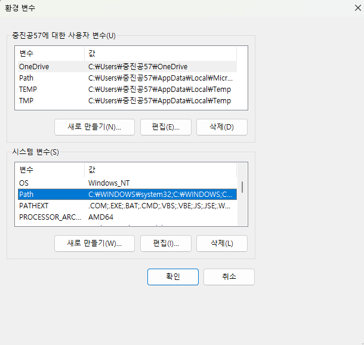

# 0528 수업 정리

MY구글드라이브 : https://drive.google.com/drive/folders/1eujclyTgw0Oi1IUq2XnfZn0GkTgVWDUI

---

여기부터 Notion에서 가져온 내용...

날짜: 2026년 5월 28일 → 2026년 5월 28일

구글드라이브: https://drive.google.com/drive/folders/1jymlT8fd3nK16Wbtr2BGTXzFFFshVilb?usp=sharing

상태: 완료

전화번호: 01072072163

# VS Code 설치 다운로드

- 다운로드 페이지 : [https://code.visualstudio.com/Download](https://code.visualstudio.com/Download)

```jsx
pwd
```

## 환경변수

- 시스템 환경변수 검색



- Path 선택 후 > 편집 버튼 클릭


# VS Code 에서 프로젝트 디렉터리 변경

- Open Folder 선택


## 폴더명 : 0528

- 폴더 모양 선택해서 0528로 지정하기


- 폴더에서 `linux_tutorial_01.md` 파일 생성하기

## 터미널 활성화가ㅣ

- 상단 탭 > Terminal > New Terminal 선택


- Launch Profile > Git-Bash 선택


## VS Code 코드 자동 저장하기

- Settings > Files : Auto Save
    - afterDelay 선택하기


## 작업파일 공유

- 1-2교시 작업한 내용 마크다운 공유

[linux_tutorial_01.zip](files/linux_tutorial_01.zip)

[linux_tutorial_01.md](files/linux_tutorial_01.txt)

# LLM Wiki를 활용한 논문쓰기

- 참고만 하세요

---------------------------------
# 0528 수업 정리

- [☀️ 오전 수업 내용 정리 - 보기 / 다운로드](files/260528_오전수업.pdf)
- [🌙 오후 수업 내용 정리 - 보기 / 다운로드](files/260528_오후수업.pdf)


## 수업 내용 필기 첨부 파일

- [0528필기 다운로드](files/0528_필기.txt)