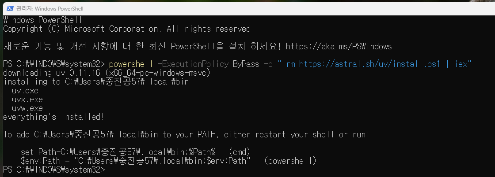
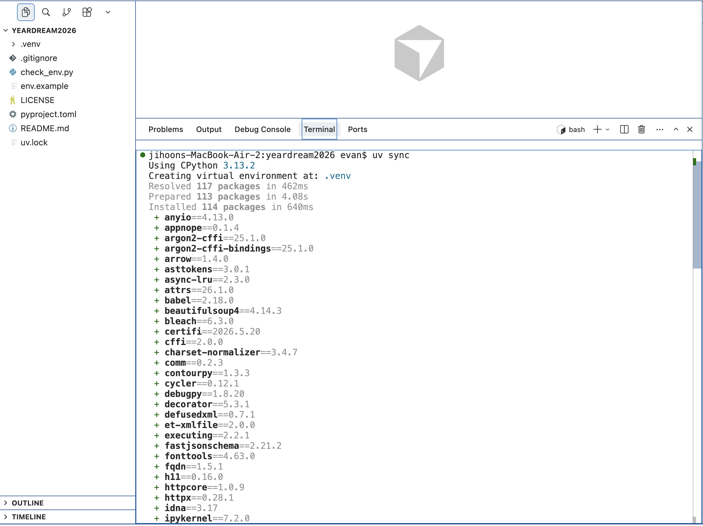
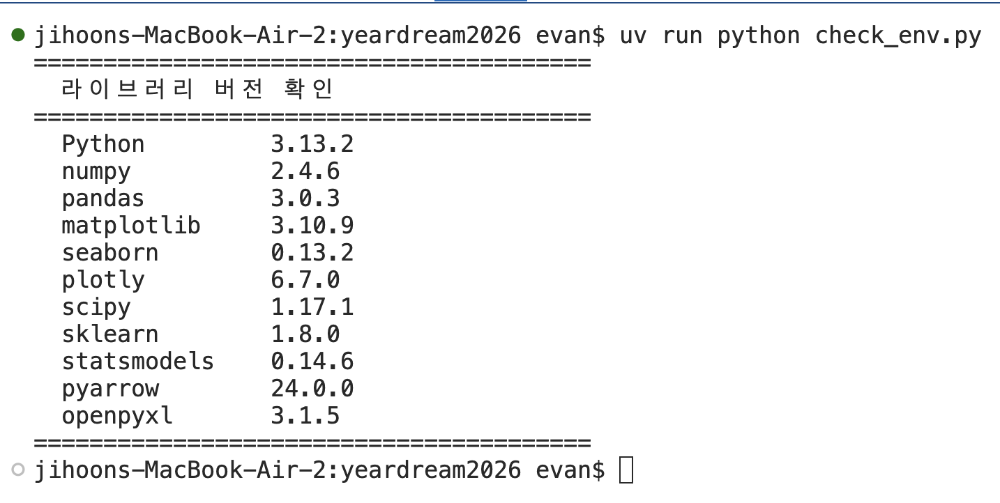
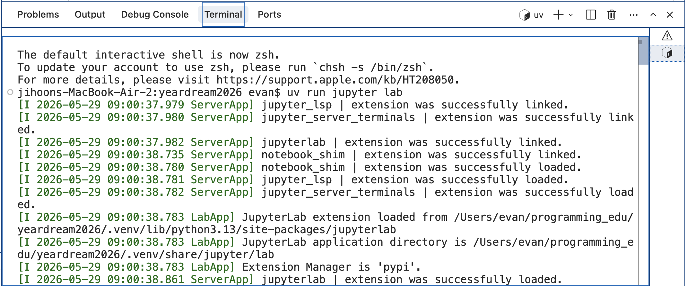

# 0529 수업 정리

MY구글드라이브 : https://drive.google.com/drive/u/0/folders/1t1071HjpEqkMr5KVF_8naV_-iTENxhMt

---

날짜: 2026년 5월 29일 → 2026년 5월 29일

구글드라이브: https://drive.google.com/drive/folders/1jymlT8fd3nK16Wbtr2BGTXzFFFshVilb?usp=sharing

상태: 완료

전화번호: 01072072163

# UV 설치

- 링크 : https://docs.astral.sh/uv/getting-started/installation/
    - MacOS는 MacOS 탭 선택해서 명령어 확인 후, 터미널에서 아래와 같이 명령어 실행합니다.
        
        ```jsx
        curl -LsSf https://astral.sh/uv/install.sh | sh
        ```
        
- PowerShell 관리자 실행
- 아래 코드 입력 및 Enter

```jsx
powershell -ExecutionPolicy ByPass -c "irm https://astral.sh/uv/install.ps1 | iex"
```



- 위 코드에서 `$env:~` 부분 복사하기 (예시) +  Enter
    - 각 사용자마다 다르기 때문에, 아래 코드 복사 금지
    - 복사 : Ctrl + Insert / 붙이기 : Shift + Insert

```jsx
$env:Path = "C:\Users\중진공57\.local\bin;$env:Path"
```

## uv 버전 확인

- `uv --version` 확인

```jsx
PS C:\WINDOWS\system32> uv --version
uv 0.11.16 (135a36367 2026-05-21 x86_64-pc-windows-msvc)
```

# 아래 파일 다운로드

- 아래파일 풀고 대기

[uv_project_settings.zip](files/uv_project_settings.zip)

# VS Code 관리자로 실행

- 실행 후, PowerShell 터미널 실행

```jsx
uv sync
```

### Mac

- bash 터미널 열고 아래와 같이 명령어 입력 `uv sync`
- 아래와 같이 Installed … 패키지 명과 버전이 에러없이 정상적으로 나오면 됩니다.



### Windows

- 같이 진행 예정

## 파일 실행 방법

- 라이브러리 버전 확인

```bash
uv run python check_env.py
```

- 아래와 같이 실행하면 라이브러리가 출력될 것입니다.



- JupyterLab 실행

```bash
uv run jupyter lab
```



## 보안 이슈

- 혹시 아래와 같이 실행이 안된다면, 현재 진행중인 보안 관련 된 부분은 잠시 해제해주시기를 바랍니다.
    - Windows 보안 검색


```jsx
PS C:\Users\중진공57\Desktop\yeardream_test> uv run python check_env.py
error: Failed to spawn: `python`
  Caused by: 애플리케이션 제어 정책에서 이 파일을 차단했습니다. (os error 4551)
```

# 실습파일

[1_실습노트북_수강생용.zip](files/1_%EC%8B%A4%EC%8A%B5%EB%85%B8%ED%8A%B8%EB%B6%81_%EC%88%98%EA%B0%95%EC%83%9D%EC%9A%A9.zip)

---------------------------------
# 0529 수업 정리

- [☀️ 오전 수업 내용 정리 - 보기 / 다운로드](files/260529_오전수업.pdf)
- [🌙 오후 수업 내용 정리 - 보기 / 다운로드](files/260529_오후수업.pdf)


## 수업 내용 필기 첨부 파일

- [0529필기 다운로드](files/0529_필기.txt)