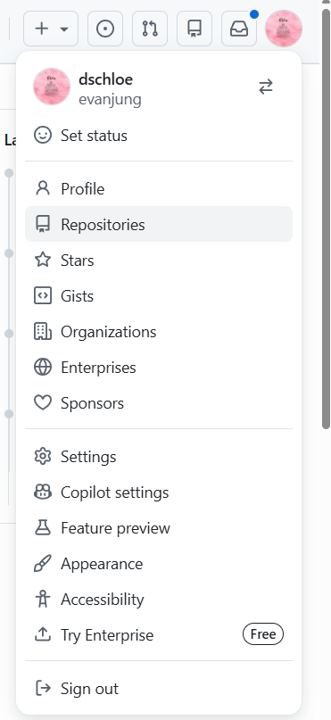

# 0601 수업 정리

MY구글드라이브 : https://drive.google.com/drive/u/0/folders/14B9d2-Amy35X0BIk1UkTQJEvBMQTfUyL

---

강의주제: 1주차-05-파이썬기본문법-2

날짜: 2026년 6월 1일

구글드라이브: https://drive.google.com/drive/folders/1UjX1dTxl2SNskiTezDvqAETNO7_GDmGw?usp=sharing

상태: 완료

전화번호: 01072072163

게시-URL: https://torch-law-f0b.notion.site/260601-370d0b4d4573800c939bfacce82dcf04?source=copy_link

# Github Repo 생성

- 프로필 > Repositories 클릭



- 아래와 같이 Repo 기본 내용 작성


# Github Repo 다운로드

- Code > HTTPS 탭 선택


- 링크 복사 하기

```jsx
git clone https://github.com/yourname/yeardreamschool6th.git
```

### git login

```jsx
git config --global user.email "you@example.com"
git config --global user.name "Your Name"
```

### git push

```jsx
git add .
git commit -m "your message"
git push
```

# UV 가상환경 설정

```jsx
uv sync
uv run jupyter lab
```

### 에러

```jsx
error: uv trampoline failed to canonicalize script path
```

- 위 에러는 다음과 같이 해결하세요 (git-bash에서)

```jsx
rm -rf .venv
uv cache clean
uv sync
uv run jupyter lab
```

---------------------------------
# 0601 수업 정리

- [☀️ 오전 수업 내용 정리 - 보기 / 다운로드](files/260601_오전수업.pdf)
- [🌙 오후 수업 내용 정리 - 보기 / 다운로드](files/260601_오후수업.pdf)


vvvvvvvvvvv