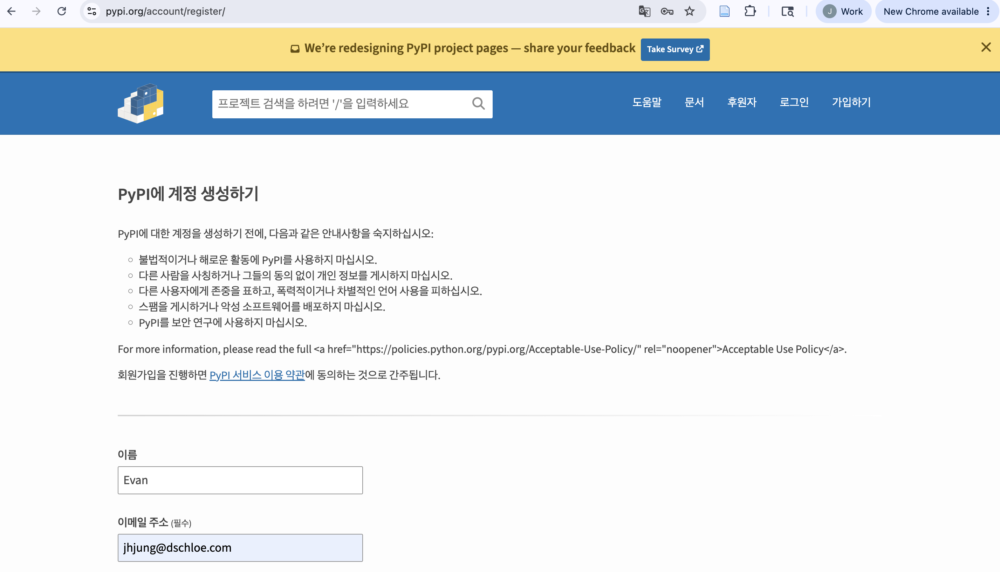
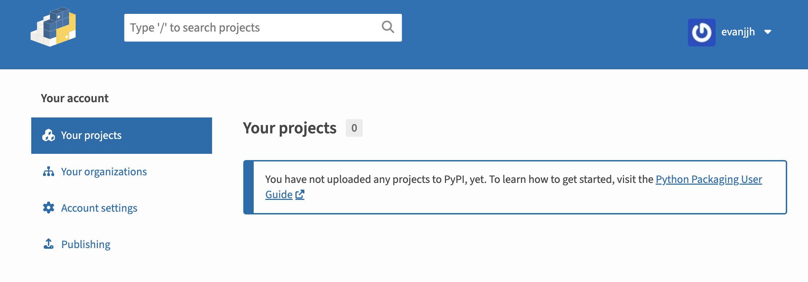
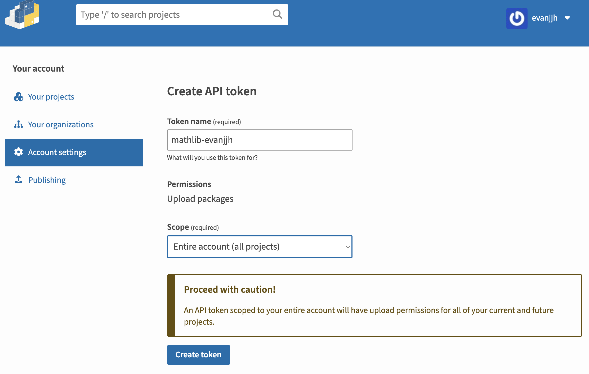
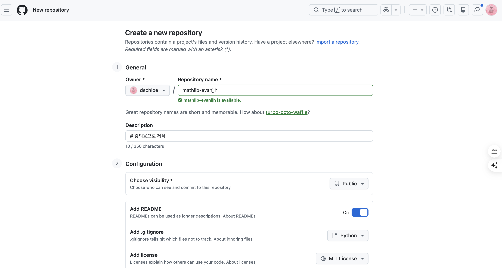
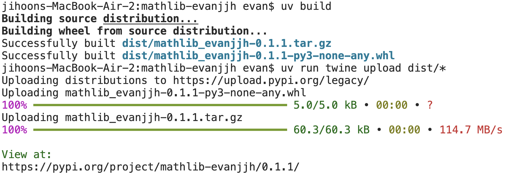

# 0604 수업 정리

MY구글드라이브 : https://drive.google.com/drive/u/0/folders/1iEo6RXGKwC1nWZL5XYSHGAPKYOuMjbua

---

강의주제: 2주차-02-파이썬라이브러리활용

날짜: 2026년 6월 4일

구글드라이브: https://drive.google.com/drive/folders/1GBSrhypSx_qwdLV6yLlsj5IsoszYMZyr?usp=sharing

상태: 완료

전화번호: 01072072163

게시-URL: https://torch-law-f0b.notion.site/260604-370d0b4d4573808984b5f5fd369d227c?source=copy_link

## 결과물 미리 확인하기

- 라이브러리 : [https://pypi.org/project/mathlib-evanjjh/](https://pypi.org/project/mathlib-evanjjh/)
- Github : https://github.com/dschloe/mathlib-evanjjh
- 전체 소스코드는 추후 공유 예정 (Google Drive 체크)

## 확인

- 모든 사람이 할 필요는 없습니다.
- 단, 개발자는 꼭 하시는 것을 추천합니다.

## 회원가입

- 링크 : [https://pypi.org/](https://pypi.org/)



- 로그인 후 화면은 다음과 같음



### API 토큰 받기

- 향후 배포할 때 반드시 필요
- 계정 설정으로 이동 > API tokens 섹션 찾기 > 페이지 아래로 스크롤 → **"API tokens"** 섹션 → **"Add API token"** 클릭
    - Token name : `mathlib-evanjjh` (임의로 변경 가능)
    - Scope : Entire account(all projects)
- Create Token 선택



## Github Repo

- Repo : mathlib-evanjjh
    - 프로젝트 이름은 의미로 변경하시기를 바랍니다.
- Repo는 다음과 같이 생성
    - repo 명 : mathlib-evanjjh
    - Public
    - .gitignore : Python
    - Add license : MIT License



## 프로젝트 구조 확인

- 프로젝트 구조는 다음과 같음
- 매우 간단한 구조이지만, 여기서 확인해야 하는 것은 버전업을 지속적으로 하는데 있음

```jsx
mathlib-evanjjh/
├── .pypirc              # 홈 디렉토리(~/)에 위치 — git에 올라가지 않음
├── pyproject.toml
├── README.md
├── LICENSE
├── src/
│   └── mathlib_evanjjh/
│       ├── __init__.py
│       ├── arithmetic.py      # v0.1.0
│       ├── geometric.py       # v0.2.0
│       └── trigonometry.py    # v0.3.0
└── tests/
    ├── __init__.py
    ├── test_arithmetic.py
    ├── test_geometric.py
    └── test_trigonometry.py
```

## 설치

- 향후 정상적으로 배포가 되면 다음과 같이 설치를 한다
- 지금은 해당 명령어 입력하지 않습니다.

```jsx
pip install mathlib-evanjjh
uv add mathlib-evanjjh
...
```

## 코드 확인

- 배포된 코드를 별도로 확인하시고 공부하세요
- Notion에서는 코드 설명은 생략합니다.

## 프로젝트 시작

- 프로젝트 초기 세팅 (최초 1회)
- git clone 으로 repo 다운로드

```jsx
git clone https://github.com/yourname/your_repo.git
```

- VS Code로 해당 repo 열고 다음과 같은 명령어 순차적으로 입력하기
    - 터미널 경로 : 프로젝트 디렉터리

```jsx
# 1. uv로 프로젝트 초기화
uv init .

# 2. src 레이아웃 패키지 폴더 생성
mkdir -p src/mathlib_evanjjh
touch src/mathlib_evanjjh/__init__.py

# 3. tests 폴더 생성
mkdir tests
touch tests/__init__.py

# 4. pytest 개발 의존성 추가
uv add --dev pytest twine
```

## 프로젝트 설정

- `pyproject.toml` 초기 파일은 다음과 같음
- 내용 읽고, 본인이 변경하고 싶은대로 변경 가능
    - name
    - authors
    - Homepage
- description은 모두 영어로 기재하는 것 추천

```jsx
[build-system]
requires = ["hatchling"]
build-backend = "hatchling.build"

[project]
name = "mathlib-evanjjh"
version = "0.1.0"
authors = [{ name = "EvanJJH", email = "j2hoon85@gmail.com" }]
description = "A class-based Python utility package for arithmetic, geometric sequences, and trigonometry"
readme = "README.md"
requires-python = ">=3.8"
classifiers = [
    "Programming Language :: Python :: 3",
    "License :: OSI Approved :: MIT License",
    "Operating System :: OS Independent",
]

[project.urls]
Homepage = "https://github.com/dschloe/mathlib-evanjjh"

[dependency-groups]
dev = ["pytest>=8.0", "twine>=6.1.0"]
```

- 프로젝트 최종 설정 위해 `uv sync` 명령어 실행

### 배포위한 API 토큰 추가

- 파일명 : `.pypirc`
    - 해당 파일은 프로젝트 디렉터리가 아니라 계정 HOME 에서 추가 작성
- vi 편집기로 작성해본다

```jsx
vi ~/.pypirc
```

```jsx
[pypi]
username = __token__
password = pypi-Ag....your_password
```

# v0.1.0 Arithmetic 클래스 (사칙연산)

### 1-1. 코드 작성 (`arithmetic.py`)

- `src/mathlib_evanjjh/arithmetic.py` 파일 생성 후 아래 코드 작성

```jsx
class Arithmetic:
    def __init__(self, a, b):
        self.a = a
        self.b = b

    def add(self):
        return self.a + self.b

    def subtract(self):
        return self.a - self.b

    def multiply(self):
        return self.a * self.b

    def divide(self):
        if self.b == 0:
            raise ValueError("0으로 나눌 수 없습니다.")
        return self.a / self.b
```

## 1-2. 테스트 작성 (`test_arithmetic.py`)

- `tests/test_arithmetic.py` 파일 생성 후 아래 코드 작성

```jsx
import pytest
from mathlib_evanjjh.arithmetic import Arithmetic

class TestArithmetic:
    def test_add(self):
        assert Arithmetic(3, 2).add() == 5

    def test_subtract(self):
        assert Arithmetic(10, 4).subtract() == 6

    def test_multiply(self):
        assert Arithmetic(3, 7).multiply() == 21

    def test_divide(self):
        assert Arithmetic(10, 2).divide() == 5.0

    def test_divide_by_zero(self):
        with pytest.raises(ValueError):
            Arithmetic(5, 0).divide()
```

### 1-3. 테스트 실행

```jsx
uv run pytest tests/test_arithmetic.py -v
```

- 아래는 결과 출력

```jsx
$ uv run pytest tests/test_arithmetic.py -v
      Built mathlib-evanjjh @ file:///Users/evan/programming_edu/mathlib-evanjjh
Uninstalled 1 package in 1ms
Installed 1 package in 1ms
===================================== test session starts =====================================
platform darwin -- Python 3.13.2, pytest-9.0.3, pluggy-1.6.0 -- /Users/evan/programming_edu/mathlib-evanjjh/.venv/bin/python
cachedir: .pytest_cache
rootdir: /Users/evan/programming_edu/mathlib-evanjjh
configfile: pyproject.toml
collected 5 items                                                                             

tests/test_arithmetic.py::TestArithmetic::test_add PASSED                               [ 20%]
tests/test_arithmetic.py::TestArithmetic::test_subtract PASSED                          [ 40%]
tests/test_arithmetic.py::TestArithmetic::test_multiply PASSED                          [ 60%]
tests/test_arithmetic.py::TestArithmetic::test_divide PASSED                            [ 80%]
tests/test_arithmetic.py::TestArithmetic::test_divide_by_zero PASSED                    [100%]

====================================== 5 passed in 0.01s ======================================
```

### 1-4. 빌드 & 배포

- 여기까지 진행했으면 이제 배포를 진행한다.

```jsx
uv build
uv run twine upload dist/*
```



### 1-5. Git Push

```jsx
git add .
git commit -m "v0.1.0: Arithmetic 클래스 추가"
git push origin main
```

## Step 2 — v0.2.0 : GeometricSequence 클래스 (등비수열) 추가

## 2-1. 코드 작성

`src/mathlib_evanjjh/geometric.py` 생성:

```jsx
class GeometricSequence:
    def __init__(self, first, ratio, n):
        self.first = first
        self.ratio = ratio
        self.n = n

    def generate(self):
        """Return a list of n terms of the geometric sequence."""
        return [self.first * (self.ratio ** i) for i in range(self.n)]

    def nth_term(self, k):
        """Return the k-th term (1-indexed)."""
        return self.first * (self.ratio ** (k - 1))

    def sum(self):
        """Return the sum of the geometric sequence."""
        if self.ratio == 1:
            return self.first * self.n
        return self.first * (1 - self.ratio ** self.n) / (1 - self.ratio)
```

### 2-2. 테스트 작성

`tests/test_geometric.py` 생성

```jsx
from mathlib_evanjjh.geometric import GeometricSequence

class TestGeometricSequence:
    def test_generate(self):
        assert GeometricSequence(1, 2, 5).generate() == [1, 2, 4, 8, 16]

    def test_nth_term(self):
        assert GeometricSequence(1, 2, 5).nth_term(3) == 4

    def test_sum(self):
        assert GeometricSequence(1, 2, 5).sum() == 31.0

    def test_ratio_one(self):
        assert GeometricSequence(5, 1, 3).generate() == [5, 5, 5]

    def test_empty(self):
        assert GeometricSequence(1, 2, 0).generate() == []
```

### 2-3. 테스트 실행

```jsx
uv run pytest tests/test_geometric.py -v
```

- 예상 결과

```jsx
$ uv run pytest tests/test_geometric.py -v
      Built mathlib-evanjjh @ file:///Users/evan/programmin
Uninstalled 1 package in 1ms
Installed 1 package in 1ms
=================== test session starts ===================
platform darwin -- Python 3.13.2, pytest-9.0.3, pluggy-1.6.0 -- /Users/evan/programming_edu/mathlib-evanjjh/.venv/bin/python
cachedir: .pytest_cache
rootdir: /Users/evan/programming_edu/mathlib-evanjjh
configfile: pyproject.toml
collected 5 items                                         

tests/test_geometric.py::TestGeometricSequence::test_generate PASSED [ 20%]
tests/test_geometric.py::TestGeometricSequence::test_nth_term PASSED [ 40%]
tests/test_geometric.py::TestGeometricSequence::test_sum PASSED [ 60%]
tests/test_geometric.py::TestGeometricSequence::test_ratio_one PASSED [ 80%]
tests/test_geometric.py::TestGeometricSequence::test_emptyPASSED [100%]
```

### 2-4. 버전 수정 & 빌드 & 배포

`pyproject.toml` 에서 버전 수정

```jsx
version = "0.2.0"
```

- 배포는 아래와 같이 진행합니다.

```jsx
uv build
uv run twine upload dist/*
```

### 2-5. Git push

```jsx
git add .
git commit -m "v0.2.0: GeometricSequence 클래스 추가"
git push origin main
```

## v0.3.0 : Trigonometry 클래스 (삼각함수) 추가

- `src/mathlib_evanjjh/trigonometry.py` 생성

```jsx
import math

class Trigonometry:
    def __init__(self, angle_deg):
        self.angle_deg = angle_deg
        self._rad = math.radians(angle_deg)

    def sin(self):
        return round(math.sin(self._rad), 10)

    def cos(self):
        return round(math.cos(self._rad), 10)

    def tan(self):
        if self.angle_deg % 180 == 90:
            raise ValueError("tan(90°) is undefined.")
        return round(math.tan(self._rad), 10)
```

- `tests/test_trigonometry.py` 생성

```jsx
import pytest
from mathlib_evanjjh.trigonometry import Trigonometry

class TestTrigonometry:
    def test_sin(self):
        assert Trigonometry(30).sin() == pytest.approx(0.5)

    def test_cos(self):
        assert Trigonometry(60).cos() == pytest.approx(0.5)

    def test_tan(self):
        assert Trigonometry(45).tan() == pytest.approx(1.0)

    def test_tan_undefined(self):
        with pytest.raises(ValueError):
            Trigonometry(90).tan()
```

- 테스트 실행

```jsx
uv run pytest tests/test_trigonometry.py -v
```

- 버전 수정
    - `pyproject.toml` 에서 버전 수정

```jsx
version = "0.3.0"
```

```jsx
uv build
uv run twine upload dist/*
```

## 설치 확인

```jsx
uv pip install --upgrade mathlib-evanjjh
```

- 실행 코드

```jsx
from mathlib_evanjjh.arithmetic import Arithmetic
from mathlib_evanjjh.geometric import GeometricSequence
from mathlib_evanjjh.trigonometry import Trigonometry

calc = Arithmetic(10, 2)
print(calc.add())       # 12
print(calc.subtract())  # 8
print(calc.multiply())  # 20
print(calc.divide())    # 5.0

gs = GeometricSequence(first=1, ratio=2, n=5)
print(gs.generate())    # [1, 2, 4, 8, 16]
print(gs.nth_term(3))   # 4
print(gs.sum())         # 31.0

print(Trigonometry(30).sin())   # 0.5
print(Trigonometry(60).cos())   # 0.5
print(Trigonometry(45).tan())   # 1.0
```

## 전체 테스트 확인

```jsx
uv run pytest tests/ -v
```

# 강의

```jsx
# ── 정렬 및 채우기 ──────────────────────────────────────────
teams = [('개발팀', 3, 16900), ('기획팀', 2, 9500), ('영업팀', 2, 9700), ('분석팀', 2, 9700)]

print(f"{'팀명':<8} {'인원':>4} {'연봉합계(만원)':>14}")
print('-' * 30)
for team_name, count, total in teams:
    # :<8  → 왼쪽 정렬, 8칸
    # :>4  → 오른쪽 정렬, 4칸
    # :>14,→ 오른쪽 정렬 14칸 + 천 단위 쉼표
    print(f'{team_name:<8} {count:>4} {total:>14,}')
```

- case 2 : if 조건으로 필터링

```jsx
# ── Case 2: if 조건으로 필터링 ──────────────────────────────

members = [
    {'name': 'Alice',  'team': '개발팀', 'salary': 6500},
    {'name': 'Bob',    'team': '기획팀', 'salary': 5200},
    {'name': 'Carol',  'team': '영업팀', 'salary': 6100},
    {'name': 'Derek',  'team': '개발팀', 'salary': 4800},
    {'name': 'Eve',    'team': '분석팀', 'salary': 3600},
    {'name': 'Fiona',  'team': '기획팀', 'salary': 4300},
    {'name': 'George', 'team': '영업팀', 'salary': 3900},
    {'name': 'Helen',  'team': '분석팀', 'salary': 5500},
]

# 연봉 5000만원 이상인 팀원 이름 추출
high_earners = [m['name'] for m in members if m['salary'] >= 5000]
print('연봉 5000만원 이상:', high_earners)

# 개발팀 팀원 이름 + 연봉
dev_info = [f"{m['name']}({m['salary']:,}만원)" for m in members if m['team'] == '개발팀']
print('개발팀 팀원        :', dev_info)

# 짝수 인덱스 팀원 이름
even_idx = [m['name'] for i, m in enumerate(members) if i % 2 == 0]
print('짝수 인덱스 팀원   :', even_idx)
```

- case 3.

```jsx
# ── Case 3: if-else로 변환 ──────────────────────────────────
# 주의: if-else가 있을 때는 순서가 달라짐!
# [표현식A if 조건 else 표현식B for 변수 in 시퀀스]

members = [
    {'name': 'Alice',  'team': '개발팀', 'salary': 6500},
    {'name': 'Bob',    'team': '기획팀', 'salary': 5200},
    {'name': 'Carol',  'team': '영업팀', 'salary': 6100},
    {'name': 'Derek',  'team': '개발팀', 'salary': 4800},
    {'name': 'Eve',    'team': '분석팀', 'salary': 3600},
]

# 연봉 5000 이상이면 '고연봉', 아니면 '일반'
salary_grade = [
    f"{m['name']}: 고연봉" if m['salary'] >= 5000 else f"{m['name']}: 일반"
    for m in members
]
for item in salary_grade:
    print(' ', item)
```

- 다중 기준 정렬

```jsx
# ── 다중 기준 정렬 ───────────────────────────────────────────
# key=lambda m: (기준1, 기준2)  →  튜플로 여러 기준 지정

members = [
    {'name': 'Alice', 'team': '개발팀', 'salary': 6500},
    {'name': 'Bob',   'team': '기획팀', 'salary': 5200},
    {'name': 'Carol', 'team': '영업팀', 'salary': 6100},
    {'name': 'Derek', 'team': '개발팀', 'salary': 4800},
    {'name': 'Eve',   'team': '분석팀', 'salary': 3600},
    {'name': 'Helen', 'team': '분석팀', 'salary': 5500},
]

# 팀명 오름차순 → 같은 팀 내에서는 연봉 내림차순
multi_sorted = sorted(members, key=lambda m: (m['team'], -m['salary']))
print('팀명 오름차순, 같은 팀 내 연봉 내림차순:')
for m in multi_sorted:
    print(f"  [{m['team']}] {m['name']:<8} {m['salary']:,}만원")
```

- 실무 예시 - 성적 순위 매기기

```jsx
print(f"{'순위':<4} {'이름':<6} {'국어':>5} {'수학':>5} {'영어':>5} {'총점':>6}")
print('-' * 35)
for rank, s in enumerate(ranked, 1):
    total = s['korean'] + s['math'] + s['english']
    print(f"{rank:<4} {s['name']:<6} {s['korean']:>5} {s['math']:>5} {s['english']:>5} {total:>6}")
```

# 0604 수업 정리

- [☀️ 오전 수업 내용 정리 - 보기 / 다운로드](files/260604_오전수업.pdf)
- [🌙 오후 수업 내용 정리 - 보기 / 다운로드](files/260604_오후수업.pdf)

## 수업 내용 필기 첨부 파일

- [0604필기 다운로드](files/0604_필기.txt)