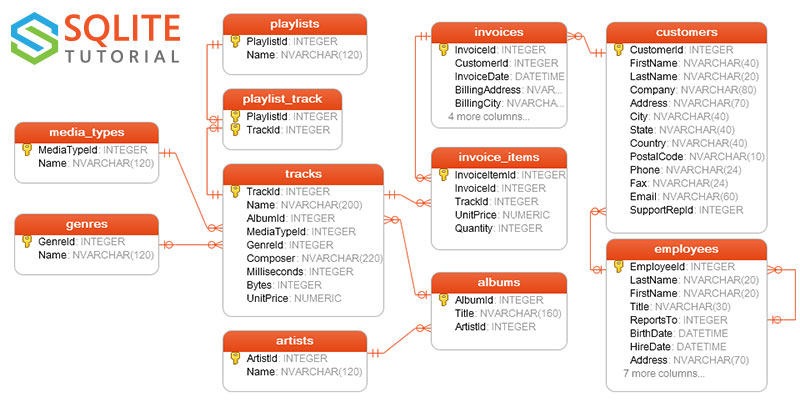
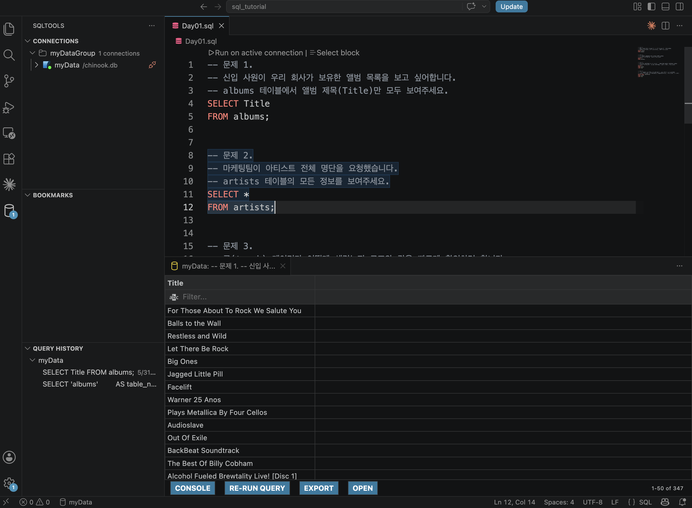
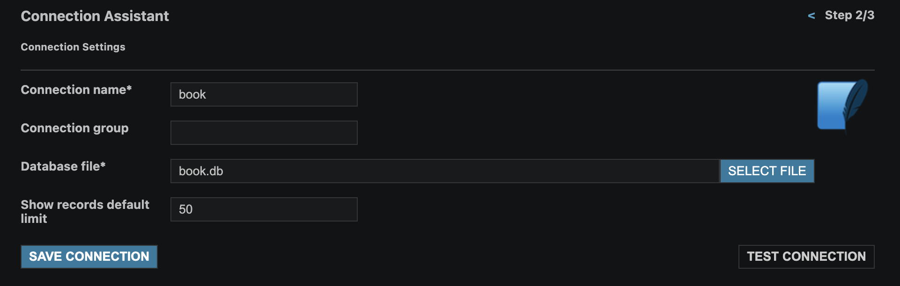

# 0608 수업 정리

MY구글드라이브 : https://drive.google.com/drive/u/0/folders/1BrFihlrJb_ynfXtNPJXFJ0aKm2zAPanP

---

강의주제: 2주차-04-SQL개요

날짜: 2026년 6월 8일

구글드라이브: https://drive.google.com/drive/folders/1EG4yghknL21tVt5fUqPD3p5o3WyH_ZyO?usp=sharing

상태: 완료

전화번호: 01072072163

게시-URL: https://torch-law-f0b.notion.site/260608-371d0b4d457380a39eaedb3393ae3de3?source=copy_link

## SQLite 튜토리얼 페이지

- 참고 : [https://www.sqlitetutorial.net](https://www.sqlitetutorial.net/sqlite-sample-database/)
- SQL 입문자들에게 필요한 기초적인 내용 수록되어 있고, SQL 책 전용 관련 1권 분량 수준으로 정리되어 있음
- 비슷한 내용의 튜토리얼은 아래와 같음
    - 오라클 : [https://www.oracletutorial.com/](https://www.oracletutorial.com/)
    - MySQL : [https://www.mysqltutorial.org/](https://www.mysqltutorial.org/)
    - PostgreSQL : [https://www.pgtutorial.com/](https://www.pgtutorial.com/)

## ERD

- ERD(Entity-Relationship Diagram, 개체-관계 다이어그램)는 데이터베이스 테이블들이 서로 어떻게 연결돼 있는지를 그림으로 표현한 설계도
- **개체(Entity)**: 각 박스 하나가 테이블 (예: `tracks`, `albums`)
- **속성(Attribute)**: 박스 안 항목이 컬럼이며 옆에 타입이 표기됨 (`INTEGER`, `NVARCHAR(120)` 등). 열쇠 아이콘(🔑)은 **기본키(PK)** 로 각 행을 고유하게 식별
- **관계(Relationship)**: 박스를 잇는 선. 선 끝 기호로 수량(카디널리티)을 표현
    - `|` (한 줄) → "하나(one)"
    - `<` (갈라진 발 모양) → "여럿(many)"
    - 한쪽 `|`, 반대쪽 `<` → **일대다(1:N)** 관계



## **Crow's Foot**

- 참고 : [**ERD "Crow's Foot" Relationship Symbols Cheat Sheet](**[https://www.vivekmchawla.com/erd-crows-foot-relationship-symbols-cheat-sheet/](https://www.vivekmchawla.com/erd-crows-foot-relationship-symbols-cheat-sheet/)**)**


### 해석

- 상단 예제 다이어그램을 위 규칙으로 해석하면 이렇게 됩니다.
- **SSN ─○┤ Has ├─ Student** — 한 학생은 SSN을 0개 또는 1개 가짐(선택적). 반대로 SSN 하나는 학생 1명에 속함
- **Student ┤├ Has ┤├ Student ID** — 학생은 학번을 정확히 1개 가짐(필수, 단 하나)
- **Student >──< Attends ──< Class** — 학생은 여러 수업을 듣고, 한 수업에도 여러 학생이 있음 → **다대다(N:M)**
- **Class >──< Teaches ┤├ Instructor** — 한 강사가 여러 수업을, 한 수업을 여러 강사가 맡을 수 있는 구조로 그려짐
- **Student ┤├ Uses ┤├ Chair** — 학생은 의자를 정확히 하나 사용
- **University ┤├ Enrolls / Employs ┤< Student·Instructor** — 대학은 학생을 등록시키고 강사를 고용(1 또는 다수)
- **Class ──○┤ Has ○ Classroom** — 수업과 강의실은 선택적으로 연결
- **Chair >──○ Has ┤├ Classroom** — 강의실은 의자를 0개 또는 다수 보유

### 기호 구성 원리

- 까마귀발 표기법의 기호는 항상 두 부분으로 읽습니다.
- **바깥쪽(테이블에 붙은 쪽)** → 최대 개수: 막대 `|` 면 "최대 1개", 까마귀발 `<` 면 "여러 개"
- **안쪽(선 쪽)** → 최소 개수: 막대 `|` 면 "최소 1개(필수)", 동그라미 `O` 면 "0개 가능(선택)"

### 종류별 기호

- **정확히 하나 (`||`)** — 막대 두 개. 관계 대상이 반드시 1개만 존재해야 함. "필수이며 단 하나"
- **0 또는 1 (`O|`)** — 동그라미 + 막대. 없을 수도 있고, 있으면 1개. 선택적 1:1 관계에서 사용
- **1 또는 다수 (`|<`)** — 막대 + 까마귀발. 최소 1개는 반드시 있고, 여러 개까지 가능. "필수이며 여럿"
- **0 또는 다수 (`O<`)** — 동그라미 + 까마귀발. 아예 없을 수도, 여러 개일 수도 있음. 1:N 관계에서 가장 흔하게 등장

## Chinook 테이블 설명

- 가상의 **디지털 음원 판매 회사**를 모델링한 DB로, 음악 카탈로그와 판매 데이터가 두 축을 이룸
- **음악 카탈로그 영역**
    - **artists** — 아티스트 정보. `ArtistId`(PK), `Name`만 있는 단순 테이블
    - **albums** — 앨범 정보. `ArtistId`로 artists와 연결 (artists 1 : N albums)
    - **tracks** — 개별 곡. DB의 중심 테이블로, `AlbumId`·`MediaTypeId`·`GenreId`로 세 테이블과 연결되고 작곡가·재생시간(`Milliseconds`)·용량(`Bytes`)·단가(`UnitPrice`) 보유
    - **media_types** — 미디어 형식(MPEG, AAC 등). tracks가 참조
    - **genres** — 장르(록, 재즈, 메탈 등). tracks가 참조
- 플레이리스트 영역
    - **playlists** — 재생목록 정보. `PlaylistId`(PK), `Name`
    - **playlist_track** — playlists와 tracks를 잇는 **연결 테이블**. 한 플레이리스트에 여러 트랙, 한 트랙이 여러 플레이리스트에 속할 수 있는 **다대다(N:M)** 관계를 표현
- 판매 영역
    - **customers** — 고객 정보. 이름·주소·연락처 등과 함께 `SupportRepId`로 담당 직원(employees)과 연결
    - **employees** — 직원 정보. `ReportsTo` 컬럼으로 **자기 자신을 참조**(상사-부하 관계)하는 점이 특징
    - **invoices** — 인보이스(주문 헤더). `CustomerId`로 customers와 연결, 청구 주소·날짜·총액 보유
    - **invoice_items** — 인보이스 상세 항목(주문 라인). `InvoiceId`로 invoices와, `TrackId`로 tracks와 연결. 어떤 곡이 몇 개(`Quantity`), 얼마(`UnitPrice`)에 팔렸는지 기록
- **핵심 관계 흐름 정리**
    - `artists → albums → tracks` : 아티스트가 앨범을 내고, 앨범에 곡이 담김
    - `tracks → invoice_items → invoices → customers` : 곡이 주문 항목으로 팔리고, 주문은 고객에게 귀속
    - `playlists ↔ tracks` : playlist_track을 통한 다대다 연결
    - `employees → customers` : 직원이 고객을 담당, 직원끼리는 상하 관계

### ERD에 적용하면

- **albums ↔ tracks**: 앨범 쪽은 막대(`|`), 트랙 쪽은 까마귀발(`<`) → 한 앨범에 여러 트랙이 속함 (1:N)
- **artists ↔ albums**: 한 아티스트가 여러 앨범을 가짐 (1:N)
- **invoices ↔ invoice_items**: 하나의 인보이스에 여러 상세 항목 (1:N)
- **playlists ↔ playlist_track ↔ tracks**: 양쪽 모두 까마귀발이라 연결 테이블을 거친 **다대다(N:M)** 관계

## 편집기 모양 바꾸기

- `Cmd+Shift+P` → **View: Editor Layout: Two Rows** 입력 → 실행



## book.db 파일 생성 및 연결



- 다른 경로에 있는 db 접속 시

```bash
Windows 경로  : C:\2026\yeardream2026_May\2_week\datasets\chinook.db
Mac 경로      : /Users/사용자이름/2026/yeardream2026_May/2_week/datasets/chinook.db
```


# 0608 수업 정리

- [☀️ 오전 수업 내용 정리 - 보기 / 다운로드](files/260608_오전수업.pdf)
- [🌙 오후 수업 내용 정리 - 보기 / 다운로드](files/260608_오후수업.pdf)

## 수업 내용 필기 첨부 파일

- [0608필기 다운로드](files/0608_필기.txt)